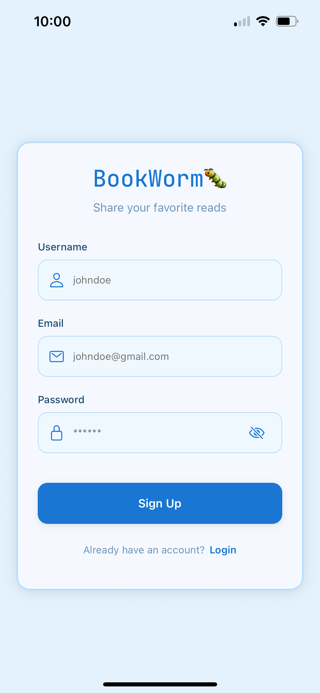

# 📚 BookHive

**BookHive** is a cross-platform book recommendation app built with **React Native** for mobile and **Node.js + Express + MongoDB** for the backend. Users can sign up, log in, share book recommendations, browse others’ posts, and manage their profile.

---

## 🌟 Features

- **User Authentication** - Secure signup, login, and logout with JWT
- **Cross-Platform** - Works on iOS, Android, and web via Expo
- **Interactive Feed** - Browse, create, and delete book recommendations
- **Media Support** - Upload cover images for your book posts
- **Profile Management** - View your own posts and update profile info
- **Customizable Themes** - Switch between multiple UI themes
- **Infinite Loading** - Optimized content loading for a seamless experience
- **Confirmation Alerts** - Friendly notifications before deleting posts
- **Backend Powered** - Node.js, Express, MongoDB, fully deployed

---

## 🗂 Project Structure
bookworm-app/
- **backend/** – Handles authentication, CRUD routes, and database interactions
- **mobile/** – React Native front-end with screens for Home, Create, Profile, and Authentication
- README.md
- .gitignore

---

## 📱 User Workflow

Here’s how the app works, step by step.

### 1️⃣ Create an Account
Sign up to start posting book recommendations.
<p></p>

### 2️⃣ Log In
Securely log in to access your feed.
<p></p>

### 3️⃣ Post a Book Recommendation
Add a book title, description, rating, and cover image.
<p></p>

### 4️⃣ Browse the Feed
View all book recommendations with smooth infinite scrolling.
<p></p>

### 5️⃣ View Your Profile
See all your posts and profile details in one place. Logout and return to the login screen.
<p></p>

---

## 🛠 Tech Stack

- **Frontend:** React Native, Expo, TypeScript
- **Backend:** Node.js, Express, MongoDB
- **Authentication:** JWT
- **Media Storage:** Cloudinary
- **Deployment:** Render for backend API hosting

---

## 🔑 Key Concepts Learned

- Building a **full-stack mobile application**
- Implementing **secure user authentication** with JWT
- Managing **CRUD operations** in a MongoDB database
- Designing **responsive mobile UIs** with React Native
- Handling **media uploads** and displaying images
- Implementing **infinite scroll** and performance optimization
- Deploying a **backend API to Render**
- Organizing environment variables with `.env`
- Debugging and integrating **frontend with backend**

---

## 💻 Setup Instructions

### Backend
```bash
# Navigate to the backend folder
cd backend

# Install dependencies
npm install

# Start the backend server
npm start
```

### Mobile
```bash
# Install Expo CLI globally (only needed once)
npm install -g expo-cli

# Navigate to the mobile app folder
cd mobile

# Install dependencies
npm install

# Start the Expo development server
npx expo start
```
